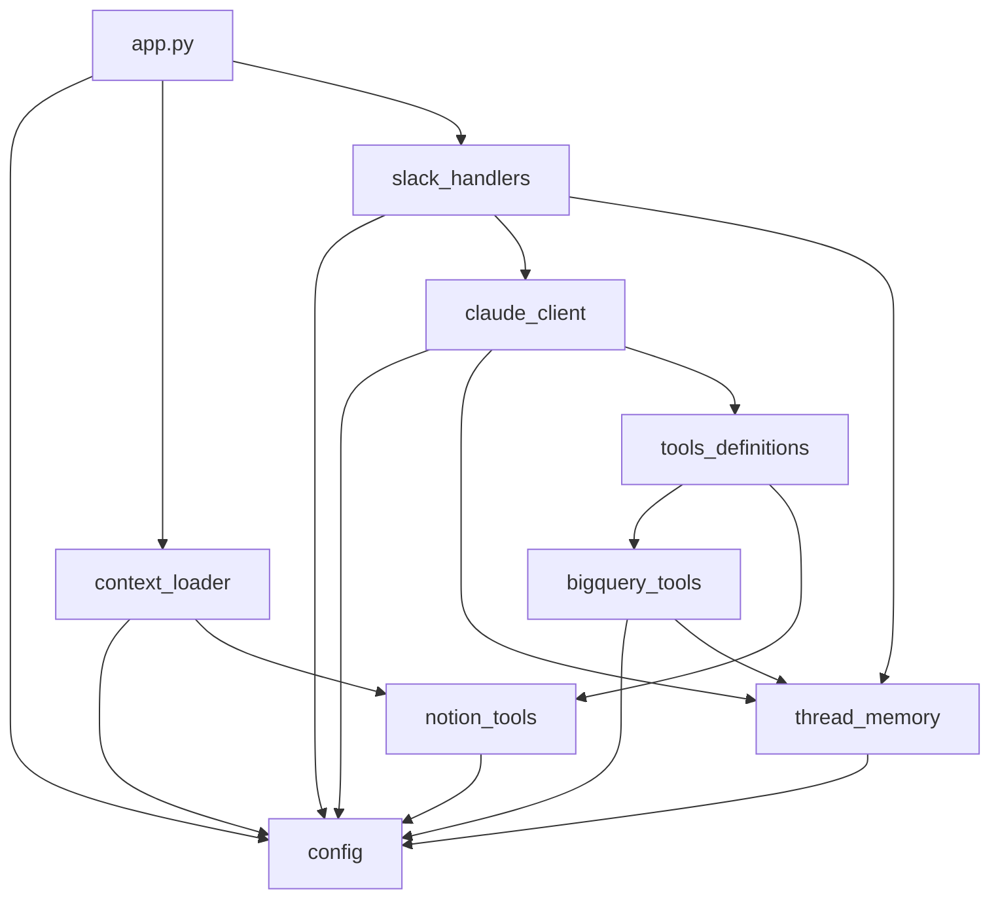

# Architecture MAEL.IA

## Vue d'ensemble

Le projet MAEL.IA a été refactorisé pour améliorer la maintenabilité et la modularité. L'application monolithique de 1235 lignes a été découpée en 9 modules spécialisés.

## Structure des modules

```
MAEL.IA/
├── app.py                    # Point d'entrée (70 lignes)
├── config.py                 # Configuration et initialisation des clients
├── context_loader.py         # Chargement du contexte (DBT, Markdown, Notion)
├── notion_tools.py           # Outils Notion (CRUD pages, tableaux)
├── bigquery_tools.py         # Outils BigQuery (requêtes, describe)
├── tools_definitions.py      # Définitions des outils pour Anthropic
├── thread_memory.py          # Gestion de la mémoire des conversations
├── claude_client.py          # Interface avec Claude API
├── slack_handlers.py         # Handlers d'événements Slack
├── context.md                # Contexte métier Blissim
├── dbt_context.md            # Documentation DBT générée
├── manifest.json             # Manifeste DBT
├── requirements.txt          # Dépendances Python
└── .env                      # Variables d'environnement
```

## Description des modules

### 1. `app.py` (Point d'entrée)
**Lignes:** 70 (réduit de 1235)
**Responsabilité:** Initialisation et démarrage de l'application

**Fonctions principales:**
- `main()`: Vérifie les services (Slack, BigQuery, Notion), charge le contexte, démarre le bot

**Dépendances:** config, context_loader, slack_handlers

---

### 2. `config.py` (Configuration)
**Responsabilité:** Centralise toute la configuration et l'initialisation des clients

**Exports:**
- **Clients:** `app`, `claude`, `bq_client`, `bq_client_normalized`, `notion_client`
- **Constantes:** `ANTHROPIC_MODEL`, `MAX_ROWS`, `MAX_TOOL_CHARS`, `TOOL_TIMEOUT_S`, `HISTORY_LIMIT`
- **Prix:** `ANTHROPIC_IN_PRICE`, `ANTHROPIC_OUT_PRICE`

**Dépendances:** dotenv, slack_bolt, anthropic, google-cloud-bigquery, notion-client

---

### 3. `context_loader.py` (Chargement du contexte)
**Responsabilité:** Charge et agrège le contexte métier depuis différentes sources

**Fonctions:**
- `parse_dbt_manifest_inline(manifest_path, schemas_filter)`: Parse le manifeste DBT
- `load_context()`: Charge contexte depuis context.md, periscope_queries.md, DBT, Notion

**Dépendances:** config, notion_tools

---

### 4. `notion_tools.py` (Outils Notion)
**Responsabilité:** Toutes les interactions avec Notion

**Fonctions:**
- `read_notion_page(page_id)`: Lit une page Notion
- `search_notion(query, object_type)`: Recherche dans Notion
- `create_notion_page(parent_id, title, content, emoji)`: Crée une page
- `create_analysis_page(parent_id, title, user_prompt, sql_query)`: Crée une page d'analyse
- `append_table_to_notion_page(page_id, headers, rows)`: Ajoute un tableau
- `append_markdown_table_to_page(page_id, headers, rows)`: Fallback Markdown

**Dépendances:** config

---

### 5. `bigquery_tools.py` (Outils BigQuery)
**Responsabilité:** Toutes les interactions avec BigQuery

**Fonctions:**
- `detect_project_from_sql(query)`: Détecte le projet (teamdata vs normalised)
- `_enforce_limit(query)`: Ajoute LIMIT automatique
- `describe_table(table_name)`: Récupère le schéma d'une table
- `execute_bigquery(query, thread_ts, project)`: Exécute une requête SQL

**Dépendances:** config, thread_memory

---

### 6. `tools_definitions.py` (Définitions des outils)
**Responsabilité:** Définit les outils disponibles pour Claude et route leur exécution

**Exports:**
- `TOOLS`: Liste des 9 outils pour Anthropic API
  1. describe_table
  2. query_bigquery
  3. query_reviews
  4. query_ops
  5. query_crm
  6. search_notion
  7. read_notion_page
  8. save_analysis_to_notion
  9. append_table_to_notion_page

**Fonctions:**
- `execute_tool(tool_name, tool_input, thread_ts)`: Routeur d'exécution

**Dépendances:** bigquery_tools, notion_tools

---

### 7. `thread_memory.py` (Mémoire des conversations)
**Responsabilité:** Gestion de l'historique des conversations par thread Slack

**Variables globales:**
- `THREAD_MEMORY`: Dict[str, List[Dict]] - Historique par thread
- `LAST_QUERIES`: Dict[str, List[str]] - Requêtes SQL par thread

**Fonctions:**
- `get_thread_history(thread_ts)`
- `add_to_thread_history(thread_ts, role, content)`
- `add_query_to_thread(thread_ts, query)`
- `get_last_queries(thread_ts)`
- `clear_last_queries(thread_ts)`

**Dépendances:** config

---

### 8. `claude_client.py` (Interface Claude)
**Responsabilité:** Communication avec l'API Anthropic Claude

**Fonctions:**
- `log_claude_usage(resp, label)`: Log des tokens et coûts (avec prompt caching)
- `get_system_prompt(context)`: Génère le prompt système pour FRANCK
- `ask_claude(prompt, thread_ts, context, max_retries)`: Envoie requête à Claude avec gestion des outils
- `format_sql_queries(queries)`: Formate les requêtes SQL pour Slack

**Caractéristiques:**
- Gestion des tool_use (jusqu'à 10 itérations)
- Retry automatique (surcharge API, timeout)
- Prompt caching (éphémère) pour réduire les coûts
- Tronquage des résultats trop longs

**Dépendances:** config, thread_memory, tools_definitions

---

### 9. `slack_handlers.py` (Handlers Slack)
**Responsabilité:** Gestion des événements Slack (@mention, messages dans threads)

**Classes:**
- `EventIdCache`: Anti-doublons pour événements

**Variables globales:**
- `seen_events`: Cache des événements traités
- `BOT_USER_ID`: ID du bot Slack
- `ACTIVE_THREADS`: Set des threads actifs

**Fonctions:**
- `get_bot_user_id()`: Récupère l'ID du bot
- `strip_own_mention(text, bot_user_id)`: Retire la mention du bot
- `setup_handlers(context)`: Configure les handlers avec le contexte
  - `@app.event("app_mention")`: Handler pour @mention
  - `@app.event("message")`: Handler pour messages dans threads

**Dépendances:** config, claude_client, thread_memory

---

## Flux de données

### 1. Initialisation (app.py → main())
```
1. Charge .env via config.py
2. Initialise clients (Slack, Claude, BigQuery, Notion)
3. Vérifie connectivité des services
4. Charge contexte (context_loader.load_context())
5. Configure handlers Slack (slack_handlers.setup_handlers(context))
6. Démarre SocketModeHandler
```

### 2. Réception d'un @mention
```
Slack → @app.event("app_mention") → slack_handlers.on_app_mention()
  ↓
ask_claude(prompt, thread_ts, context) → claude_client
  ↓
Claude API avec TOOLS → Anthropic
  ↓
[Si tool_use] → execute_tool() → tools_definitions
  ↓
[Route vers] → bigquery_tools / notion_tools
  ↓
Résultat → Claude pour synthèse
  ↓
Réponse formatée → Slack channel/thread
  ↓
Sauvegarde dans thread_memory
```

### 3. Message dans un thread actif
```
Slack → @app.event("message") → slack_handlers.on_message()
  ↓
[Vérifie thread_ts dans ACTIVE_THREADS]
  ↓
ask_claude(text, thread_ts, context)
  ↓
[Même flux que @mention]
```

## Avantages de la nouvelle architecture

### ✅ Maintenabilité
- **Séparation des responsabilités:** Chaque module a un rôle clair
- **Code lisible:** Fichiers plus courts (70-300 lignes vs 1235)
- **Debugging facile:** Isolation des erreurs par module

### ✅ Réutilisabilité
- **Modules indépendants:** notion_tools peut être utilisé dans d'autres projets
- **Fonctions atomiques:** Chaque fonction a une responsabilité unique

### ✅ Testabilité
- **Tests unitaires:** Facile de tester chaque module isolément
- **Mocking simplifié:** Dépendances claires et injectables

### ✅ Évolutivité
- **Ajout de fonctionnalités:** Créer un nouveau module sans toucher aux autres
- **Nouveaux outils:** Ajouter dans tools_definitions.py
- **Nouveaux handlers:** Étendre slack_handlers.py

## Dépendances entre modules



## Migration depuis l'ancienne version

L'ancienne version monolithique de `app.py` (1235 lignes) a été entièrement refactorisée. **Aucune fonctionnalité n'a été perdue**, tout a simplement été réorganisé.

**Correspondance:**
- Lignes 1-66 (init) → `config.py`
- Lignes 70-275 (contexte/notion) → `context_loader.py` + `notion_tools.py`
- Lignes 323-535 (tools) → `tools_definitions.py`
- Lignes 541-563 (thread memory) → `thread_memory.py`
- Lignes 567-709 (BigQuery) → `bigquery_tools.py`
- Lignes 1020-1101 (ask_claude) → `claude_client.py`
- Lignes 986-1185 (handlers Slack) → `slack_handlers.py`
- Lignes 1189-1235 (main) → `app.py`

## Prochaines étapes recommandées

1. **Tests unitaires:** Créer tests/ avec pytest
2. **CI/CD:** Ajouter GitHub Actions pour tests automatiques
3. **Logging structuré:** Remplacer print() par logging avec niveaux
4. **Type hints complets:** Ajouter typing partout pour mypy
5. **Documentation API:** Générer docs avec Sphinx
6. **Monitoring:** Intégrer Sentry pour tracking erreurs
